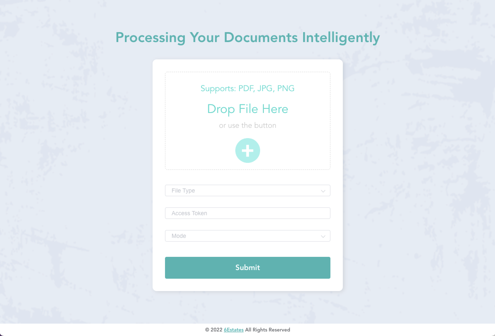

6Estates Intelligent Document Platform（IDP） Tutorial
===========

__You can follow our [Online Tutorial](https://github.com/6estates/idp-tutorial/wiki/A-Tutorial-on-Integrating-6Estates-IDP-Service) or the [Youtube Video](https://www.youtube.com/watch?v=Ov1LX4sGQPw) to integrate our 6Estates IDP service into your applications.__

You can also try our IDP platform by directly using the following demo application.

##  A Demo Web Application 

Here we provide a web project for your reference on how to use IDP SDK to intergrate 6Estates' IDP service into your web application.

### 1 To Start the Backend Service 

The backend service is a Web Service developed using Spring Boot. 

Please refer to the [README](./backend/README.md) in the `backend` folder to start the Web service. 

### 2 To Start the Dashboard

The Dashboard is developed using Nodejs.

Please refer to the [README](./frontend/README.md) in the `frontend` folder to start the Dashboard. 

### 3 How to use 

After you successfully start both services, you can open a web browser and enter the URL: http://localhost:8080/. 

Now you shall see that the dashboard looks like the image above and you can start a trial by simply uploading a file.  

### 4 Any Issues & Feedbacks?

If you find a bug or would like to add new features in the tutorial project, it would be appreciated that you open issues or pull requests against this repo!

Feel free to inform us if you have any feedbacks while you are using this tutorial!  
